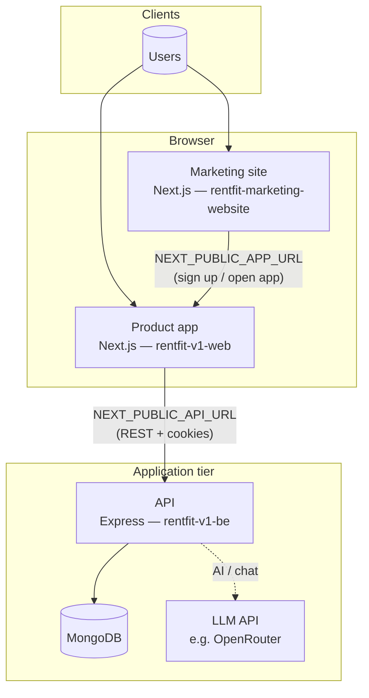

# RentFit meta

Thin repository that groups the RentFit stack as [Git submodules](https://git-scm.com/book/en/v2/Git-Tools-Submodules): **API** ([rentfit-v1-be](https://github.com/deagleSC/rentfit-v1-be)), **product app** ([rentfit-v1-web](https://github.com/deagleSC/rentfit-v1-web)), and **marketing site** ([rentfit-marketing-website](https://github.com/deagleSC/rentfit-marketing-website)).

## Clone

```bash
git clone --recurse-submodules https://github.com/deagleSC/rentfit-meta.git
cd rentfit-meta
```

If you already cloned without submodules:

```bash
git submodule update --init --recursive
```

## Layout

| Path                       | Role                               |
|----------------------------|------------------------------------|
| `rentfit-v1-be`            | API — Express, TypeScript, MongoDB |
| `rentfit-v1-web`           | Product app — Next.js              |
| `rentfit-marketing-website`| Marketing site — Next.js           |

## System design

RentFit splits **marketing** (discovery and CTAs), **product** (authenticated app and AI search), and **API** (data and auth). The marketing site sends users to the product URL configured at build time; the product talks to the API; the API persists data in MongoDB and can call an LLM provider for AI features.



## Local development

1. **MongoDB** — running locally (default URI is in `rentfit-v1-be`’s `.env.example`).
2. **Backend** — in `rentfit-v1-be`, copy `.env.example` to `.env`, install deps, then:

   ```bash
   cd rentfit-v1-be && npm install && npm run dev
   ```

   Default API URL is `http://localhost:8000`.

3. **Product frontend** — in `rentfit-v1-web`, copy `.env.example` to `.env`. Point the app at the API (defaults in `.env.example` already use `http://localhost:8000` for `NEXT_PUBLIC_API_URL`):

   ```bash
   cd rentfit-v1-web && npm install && npm run dev
   ```

4. **Marketing site** — in `rentfit-marketing-website`, copy `.env.example` to `.env` if needed, then:

   ```bash
   cd rentfit-marketing-website && npm install && npm run dev -- -p 3001
   ```

   Use another port (here `3001`) if `rentfit-v1-web` is already on `3000`.

5. **CORS** — for cookies and credentialed requests, ensure `CORS_ORIGIN` in the backend `.env` includes your product app origin (e.g. `http://localhost:3000`).

## Editor

Open `rentfit.code-workspace` in VS Code or Cursor for a multi-root workspace over all submodules.

## Working inside a submodule

Commits and pushes happen **inside** each submodule directory on that repo’s branches. From the meta repo, `git status` only shows when a submodule pointer has moved; push submodule changes from `rentfit-v1-be`, `rentfit-v1-web`, or `rentfit-marketing-website`, then commit the updated pointers in `rentfit-meta` if you want the meta repo to record those revisions.

## Updating submodule checkouts

```bash
git submodule update --remote --merge
```

(Review changes in each repo before committing updated submodule SHAs in this repo.)
