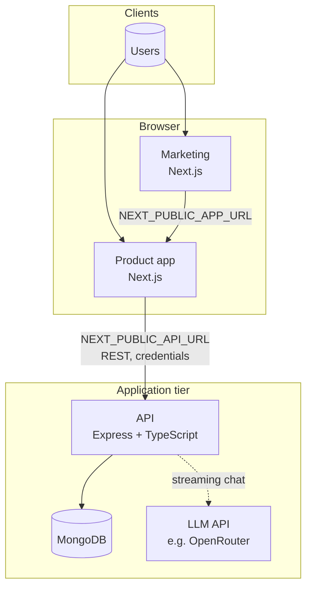

# RentFit — engineering guide

This repository ([**rentfit-meta**](https://github.com/deagleSC/rentfit-meta)) is the **umbrella checkout** for the RentFit stack. It does not ship application code itself; it pins three services as [Git submodules](https://git-scm.com/book/en/v2/Git-Tools-Submodules) so you can clone one workspace, align versions, and onboard engineers from a single document.

| Service | Submodule | Responsibility |
|--------|-----------|----------------|
| **API** | [`rentfit-v1-be`](https://github.com/deagleSC/rentfit-v1-be) | REST API, auth (JWT in httpOnly cookies), listings, maps, persisted chats, streaming AI via OpenRouter-compatible API |
| **Product app** | [`rentfit-v1-web`](https://github.com/deagleSC/rentfit-v1-web) | Next.js SPA: search, listings, MapLibre maps, AI chat (Vercel AI SDK), session with API |
| **Marketing** | [`rentfit-marketing-website`](https://github.com/deagleSC/rentfit-marketing-website) | Next.js marketing site; deep-links to the product app (`NEXT_PUBLIC_APP_URL`) |

**Prerequisites everywhere:** Node.js **20+**, **MongoDB** (local or Atlas) for the API. Each submodule has its own `package.json` and `.env.example`.

---

## Clone this workspace

```bash
git clone --recurse-submodules https://github.com/deagleSC/rentfit-meta.git
cd rentfit-meta
```

Already cloned without submodules:

```bash
git submodule update --init --recursive
```

**Editor:** open [`rentfit.code-workspace`](rentfit.code-workspace) in VS Code or Cursor for a multi-root workspace over all three submodules.

---

## System architecture

Traffic is split by **role**: marketing is mostly static/SSR pages plus links into the product; the product owns authenticated flows and all **direct** API access. The API owns persistence and calls an **LLM provider** (configured for [OpenRouter](https://openrouter.ai/)) for chat.



**Engineering implications**

- Marketing and product are **different origins** in production; only the **product** origin must appear in the API’s `CORS_ORIGIN` for cookie-based auth (marketing does not call the API for session in the default setup).
- `NEXT_PUBLIC_*` on both Next apps is **inlined at build time**; changing Vercel env vars requires a **redeploy** of that frontend.
- The API uses **Helmet**, **CORS**, **cookie-parser**, and **Zod**; responses are generally `{ success, data }` or `{ success, error }` except streaming chat.

---

## Authentication and cross-origin behavior

| Topic | Detail |
|-------|--------|
| Session | JWT carried in an **httpOnly** cookie (`AUTH_COOKIE_NAME`, default `rentfit_session`) |
| Browser → API | Product client uses **credentialed** requests (`withCredentials` / `credentials: "include"`) |
| CORS | `CORS_ORIGIN` must list the **exact** product origin (scheme + host + port). Multiple origins: comma-separated |
| SameSite | In production with **cross-origin** SPA + API, do **not** set `AUTH_COOKIE_SAMESITE=lax`; defaults allow `SameSite=None` + `Secure` where appropriate |
| Production secrets | `JWT_SECRET` and `OPENROUTER_API_KEY` are **required** when `NODE_ENV=production` |

---

## HTTP API surface (`rentfit-v1-be`)

Documented interactively via **Swagger UI** when the server is running (`registerSwagger` in the codebase).

| Area | Notes |
|------|--------|
| **Auth** | `POST /api/auth/register`, `POST /api/auth/login`, `POST /api/auth/logout`, `GET` / `PATCH /api/auth/me` |
| **Chat** | `POST /api/chat` — streaming; client must send credentials |
| **Listings / map / areas / chats** | `/api/listings`, `/api/map`, `/api/service-areas`, `/api/chats` |
| **Health** | `GET /health` |

**Deploy note:** the backend repo includes Vercel serverless wiring (`vercel.json`, `api/index.js`) so the Express app can run as a bundled serverless function with `dist/`.

---

## Environment variables

Copy each submodule’s `.env.example` → `.env`. Below is a **concise** reference; authoritative comments live in those files.

### API — `rentfit-v1-be`

| Variable | Production | Purpose |
|----------|------------|---------|
| `NODE_ENV` | Set `production` | Runtime mode |
| `PORT` | Optional (platform may override) | HTTP port; default **8000** locally |
| `MONGODB_URI` | Required for real data | Mongo connection string |
| `CORS_ORIGIN` | Required | Allowed browser origins for credentialed CORS |
| `JWT_SECRET` | **Required** | Signing key for JWT |
| `JWT_EXPIRES_SEC` | Optional | Session length (default 7 days) |
| `AUTH_COOKIE_NAME` | Optional | Cookie name |
| `AUTH_COOKIE_SAMESITE` | Careful for cross-site | `lax` / `strict` / `none` — see submodule README |
| `OPENROUTER_API_KEY` | **Required** for chat | LLM provider key |
| `OPENROUTER_MODEL` | Optional | Default `openai/gpt-4o-mini` |
| `OPENROUTER_BASE_URL` | Optional | Default OpenRouter API base |
| `OPENROUTER_HTTP_REFERER`, `OPENROUTER_APP_TITLE` | Optional | OpenRouter attribution headers |

### Product app — `rentfit-v1-web`

| Variable | Notes |
|----------|--------|
| `NEXT_PUBLIC_API_URL` | API base URL, **no trailing slash**; must match a `CORS_ORIGIN` entry |
| `NEXT_PUBLIC_SITE_URL` | Canonical URL for metadata / OG / absolute assets; on Vercel, `VERCEL_URL` can apply if unset |

### Marketing — `rentfit-marketing-website`

| Variable | Notes |
|----------|--------|
| `NEXT_PUBLIC_SITE_URL` | Canonical marketing site URL (no trailing slash) |
| `NEXT_PUBLIC_APP_URL` | Product app URL for CTAs (no trailing slash); local dev e.g. `http://localhost:3000` |

---

## Local development

### Default ports

| Service | Default port | Override |
|---------|--------------|----------|
| API | **8000** | `PORT` in `.env` |
| Product (Next) | **3000** | `next dev -p …` |
| Marketing (Next) | **3000** | Run as `npm run dev -- -p 3001` if product already uses 3000 |

### Recommended order

1. Start **MongoDB** (local default in API: `mongodb://127.0.0.1:27017/rentfit` if `MONGODB_URI` unset).
2. **API:** `cd rentfit-v1-be && npm install && cp .env.example .env` → edit → `npm run dev`. Verify `GET http://localhost:8000/health`.
3. **Product:** `cd rentfit-v1-web && npm install && cp .env.example .env` → set `NEXT_PUBLIC_API_URL=http://localhost:8000` → ensure API `CORS_ORIGIN` includes `http://localhost:3000` → `npm run dev`.
4. **Marketing (optional):** `cd rentfit-marketing-website && npm install && cp .env.example .env` → point `NEXT_PUBLIC_APP_URL` at the product dev URL → `npm run dev -- -p 3001`.

### API maintenance scripts

Run from `rentfit-v1-be`:

| Script | Purpose |
|--------|---------|
| `npm run seed:service-areas` | Seed service areas |
| `npm run seed:sample-listings` | Seed sample listings |
| `npm run backfill:listing-city-slugs` | Backfill listing city slugs |
| `npm run typecheck` | `tsc --noEmit` |

---

## Tech stack (summary)

| Layer | Technologies |
|-------|----------------|
| API | Express 4, TypeScript, Mongoose, Zod, JWT, cookie-parser, Helmet, Swagger UI, Vercel AI SDK server-side (`ai`, `@ai-sdk/openai`) |
| Product | Next.js 16 (App Router), React 19, TypeScript, Tailwind 4, Vercel AI SDK (`@ai-sdk/react`, `ai`), Axios + credentials, MapLibre, Zustand, Radix/shadcn-style UI |
| Marketing | Next.js 16, React 19, TypeScript, Tailwind 4, Framer Motion, Radix |

---

## Build, quality, and formatting

| Location | Common commands |
|----------|-----------------|
| `rentfit-v1-be` | `npm run build` → `dist/`; `npm start`; `npm run dev`; `npm run typecheck`; `npm run format` |
| `rentfit-v1-web` | `npm run build`; `npm start`; `npm run dev`; `npm run lint`; `npm run format`; optional `build:prod` / `start:prod` for standalone output |
| `rentfit-marketing-website` | `npm run build`; `npm start`; `npm run dev`; `npm run lint`; `npm run format` |

---

## Deployment (typical: Vercel)

1. **Three projects** (or equivalent): API, product, marketing — each from its **own Git repository** (not only the meta repo), unless you use a different pipeline.
2. **API:** set all production variables from the API table; confirm `CORS_ORIGIN` includes the **deployed product URL** exactly.
3. **Product:** set `NEXT_PUBLIC_API_URL` to the **deployed API origin**; set `NEXT_PUBLIC_SITE_URL` to the **deployed app URL** for stable metadata.
4. **Marketing:** set `NEXT_PUBLIC_SITE_URL` and `NEXT_PUBLIC_APP_URL` to the deployed marketing and product URLs.
5. After changing any `NEXT_PUBLIC_*` variable, **redeploy** that Next.js project.

---

## Git: submodules and pinning

- **Application history** lives in each submodule’s remote. Commit and push **inside** `rentfit-v1-be`, `rentfit-v1-web`, or `rentfit-marketing-website` on the appropriate branch.
- **This meta repo** records **which commit** each submodule points to. After updating submodules, commit here if you want the team to share the same SHAs:

  ```bash
  cd rentfit-v1-web   # example
  git pull origin main
  cd ..
  git add rentfit-v1-web
  git commit -m "chore: bump rentfit-v1-web"
  ```

- Pull latest submodule commits from their remotes (use with care; review diffs):

  ```bash
  git submodule update --remote --merge
  ```

---

## Production checklist (short)

- [ ] `JWT_SECRET` set and rotated policy defined  
- [ ] `MONGODB_URI` points to production cluster  
- [ ] `CORS_ORIGIN` matches deployed product origin(s)  
- [ ] Cross-origin cookie / `AUTH_COOKIE_SAMESITE` behavior validated in staging  
- [ ] `OPENROUTER_API_KEY` set; model and base URL as intended  
- [ ] All `NEXT_PUBLIC_*` values correct and frontends redeployed after changes  

For deeper detail per service, see each submodule’s `README.md` and `.env.example`.
